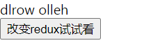
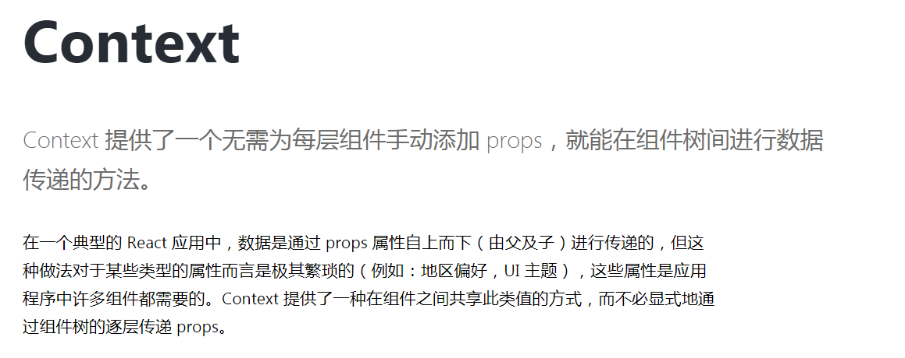

# 揭秘Redux怎么和React协作
> React需要数据状态管理，因为组件化开发，不可避免的会遇到夸层级的数据通信，用一个统一的数据状态管理代替层层传入的props的方式更加利于维护和优雅。笔者认为，React不一定非得使用Redux，但凡实现了数据状态管理并且提供了足够的开放能力比如钩子、观察者、中间件等都可以与React结合，单纯来说，只实现了数据管理+观察者便足矣。至于为什么使用Redux，可能是因为他使用的广吧。本文将分析两者之间如何协作，以及解析社区已经封装好了的库react-redux。如果对redux感兴趣的话，可以翻阅上一篇文章[从0到1重新撸一个redux](https://www.yuque.com/lemon-nfzit/uwwtaw/wflm60)
<br />
<br />
> 还是老样子，本文先不谈react-redux源码，先从应用场景出发

## 先把组件跟redux连接起来
熟悉react的开发者都知道，react主张单向数据流，通过改变state可以重新出发render更新视图，对于组件化开发模式，通过state数据传入子组件props来传递数据，通过父组件封装的setState改变state更新视图。所以说，核心都在于state以及改变state的方法。于是乎我们得出连接的方式：
- 把store的数据跟state连接
- 监听store更新来改变state
来看看怎么实现吧：
```
// redux module
import {createStore} from 'redux'
const initState = {
    text: 'hello world'
}
function reducer(state = initState, action) {
    switch(action.type) {
       case 'reverse_text':
            state.text = state.text.reverse();
            return state;
        default:
            return state;
    }
}
export const store = createStore(reducer, initState)
```

```
import React from 'react'
import { store } from './redux';

export default class Header extends React.Component {
    constructor(props) {
        super(props);
        this.state = {
            text: store.getState().text
        }
    }

    componentDidMount() {
        store.subscribe(() => {
            console.log(store.getState())
            this.setState({
                text: store.getState().text
            })
        })
    }

    render() {
        return (
            <div className="hello-header">
                {this.state.text}
            </div>
        );
    }
}
```
原理很简单，初始化数据从store读，调用subscribe监听store变化重新setState，让我们来看看在其他的组件里怎么更新Header组件吧
```
import React from 'react'
import { store } from './redux';

export default class Bottom extends React.Component {
  constructor(props) {
    super(props);
  }

  componentDidMount() {
      console.log(store)
  }

  render() { 
    return ( 
      <div className="hello-bottom">
        <button onClick={() => {
            store.dispatch({
                type: 'reverse_text'
            })
        }}>改变redux试试看</button>
      </div>
     );
  }
}
 
```
```
import React from 'react'
import './App.css';
import Header from './header';
import Bottom from './bottom';

export default class App extends React.Component {
  constructor(props) {
    super(props);
  }
  
  render() { 
    return ( 
      <div className="hello-app">
        <Header />
        <Bottom />
      </div>
     );
  }
}
 
```
看吧，如此一来同级组件的数据通信问题美妙解决，别看上面的例子很短小，如果组件层级过多过深，层层传递props的做法简直难受。<br />
 
<br />
这应该算是react-redux最基础的实现了。当然不可能会这么简单

## 更合理的连接方式
上面的设计固然可用，但是我们试想，一个大型的复杂项目，组件少说几十多辄上千，需要统一管理的数据肯定是非常多的，对于需要使用store数据的组件更是多如牛毛，不可能对这些组件每个都进行读store和注册监听吧。于是乎我们需要设计一种更加合理，无侵入式的连接方法。
- 最顶层的组件统一挂载store，让后续所有层级的子组件都可以访问整个store
- 对需要连接store的组件提供一个更友好的api，而非侵入式的写入constructor和生命周期

### 统一挂载store
看似非常简单，我们写出了以下代码：
```
import React from 'react'
import './App.css';
import Header from './header';
import Bottom from './bottom';
import { store } from './redux';

export default class App extends React.Component {
  constructor(props) {
    super(props);
    this.state = {
        store: store.getState()
    }
  }
  
  render() { 
    const {store} = this.state;
    return ( 
      <div className="hello-app">
        <Header store={store} />
        <Bottom store={store} />
      </div>
     );
  }
}
```
这勉强能行，但是如果Header&Bottom本身也是高阶组件，那么无法避免需要将store从最顶层不断通过props去传输，十分尴尬。这时候我们掀开react-redux的神秘面纱，抱歉久等了~
<br />
react-redux提供一个叫做Provider的组件，使用方法也十分简单
```
import React from 'react'
import './App.css';
import Header from './header';
import Bottom from './bottom';
import { store } from './redux';
import { Provider } from 'react-redux';

export default class App extends React.Component {
  constructor(props) {
    super(props);
    this.state = {
        store: store.getState()
    }
  }
  
  render() { 
    const {store} = this.state;
    return ( 
      <Provider store={store}>
        <Header />
        <Bottom />
      </Provider>
     );
  }
}
```
如此这般便能完美解决层层传递store的困境，究竟做了什么，翻开源码吧！
```
import React, { Component } from 'react'
import { ReactReduxContext } from './Context'
import Subscription from '../utils/Subscription'

const ReactReduxContext = React.createContext(null)

class Provider extends Component {
  constructor(props) {
    super(props)

    const { store } = props

    this.notifySubscribers = this.notifySubscribers.bind(this)
    const subscription = new Subscription(store)
    subscription.onStateChange = this.notifySubscribers

    this.state = {
      store,
      subscription
    }

    this.previousState = store.getState()
  }

  componentDidMount() {
    this._isMounted = true

    this.state.subscription.trySubscribe()

    if (this.previousState !== this.props.store.getState()) {
      this.state.subscription.notifyNestedSubs()
    }
  }

  componentWillUnmount() {
    if (this.unsubscribe) this.unsubscribe()

    this.state.subscription.tryUnsubscribe()

    this._isMounted = false
  }

  componentDidUpdate(prevProps) {
    if (this.props.store !== prevProps.store) {
      this.state.subscription.tryUnsubscribe()
      const subscription = new Subscription(this.props.store)
      subscription.onStateChange = this.notifySubscribers
      this.setState({ store: this.props.store, subscription })
    }
  }

  notifySubscribers() {
    this.state.subscription.notifyNestedSubs()
  }

  render() {
    const Context = this.props.context || ReactReduxContext

    return (
      <Context.Provider value={this.state}>
        {this.props.children}
      </Context.Provider>
    )
  }
}

export default Provider

```
最新的react-redux已经是更新到Hook版本，为了方便大家理解，用的是老版本7.0，别看代码多，关键点有两个
- 从props接收store，并且设置为自身的state
- React.createContext

createContext作用如下，也可以直接查看官方文档[React.createContext](https://zh-hans.reactjs.org/docs/context.html#reactcreatecontext)


### 无侵入的让需要的组件进行连接 - connect
先看看怎么使用吧
```
import React from 'react'
import { store } from './redux';
import { connect } from 'react-redux'

class Header extends React.Component {
    constructor(props) {
        super(props);
    }

    render() {
        return (
            <div className="hello-header">
                {this.props.text}
                <button onClick={this.props.reverse}>reverse</button>
            </div>
        );
    }
}

const mapStateToProps = (state) => {
  return {
    text: state.text
  }
}
const mapDispatchToProps = (
  dispatch,
  ownProps
) => {
  return {
    reverse: () => {
      dispatch({
        type: 'reverse_text',
      });
    }
  };
}

const HeaderWrapper = connect(
  mapStateToProps,
  mapDispatchToProps
)(Header)

export default  HeaderWrapper
```
通过connect api 可以在mapStateToProps定义我们组件需要从store订阅的数据，通过mapDispatchToProps定义我们组件需要存在哪些可以更新store数据的方法，相比之前的做法简直完美，我们只需要专注组件本身的业务，十分松散不需耦合。
表面上看起来越是优雅大气，相对的，其背后必然隐藏着设计和实现越是复杂和深邃。connect就是如此，个人认为connect是react-redux最复杂和最难理解的部分。但是我们可以依样画葫芦实现最简单的版本。我们根据上面的代码可以合理推测出以下2点功能。
- connect根据传入的mapStateToProps，mapDispatchToProps，Header返回一个高阶组件，并且mapStateToProps，mapDispatchToProps配置的属性和方法进行注入
- 返回的高阶组件可以跟store相互通信。

第一点可以如下简单实现

```
function connectHoc (mapStateToProps = () => ({}), mapDispatchToProps = () => ({})) {
  return function wrapWithConnect (wrappedComponent) {
    function connectFunction (props) {
      const [_, setState] = useState(0)
      const store = useContext(defaultContext)

      // 这里是为了每次store更新就更新state来刷新组件
      // 相当于就是非常粗暴的订阅store
      useEffect(() => {
        return store.subscribe(update)
      }, [])

      function update () {
        setState(times => ++times)
      }
      
      const stateProps = mapStateToProps(store.getState())
      
      const dispatchProps = mapDispatchToProps(store.dispatch)
      
      const allProps = {
          ...props,
          ...stateProps,
          ...dispatchProps
      }
      
      return <wrappedComponent {...allProps} />
      
    }
    // 为了阻止父组件render带来的不必要更新
    // 可以把他理解成更高级的React.PureComponent 
    return React.memo(ConnectFunction)
  }
}
```
以上代码能实现我们推测出的两个功能，但是非常粗暴，被我们CONNECT的组件，只要store更新了全都会被更新，而不是store更新了组件mapStateToProps订阅的数据才更新，我们需要connect能记住我们需要的数据，并且在store更新了这些数据的时候才进行组件更新。来看看怎么操作 <br />

因为要对比前后数据更新，先写一些判断数据的方法
```
// 判断基础类型强相等 排除掉0 和 1的布尔值自动转换带来的弊端
function is(x, y) {
  if (x === y) {
    return x !== 0 || y !== 0 || 1 / x === 1 / y
  } else {
    return x !== x && y !== y
  }
}

// 判断引用类型强相等
export function shallowEqual(objA, objB) {
  if (is(objA, objB)) return true

  if (
    typeof objA !== 'object' ||
    objA === null ||
    typeof objB !== 'object' ||
    objB === null
  ) {
    return false
  }

  const keysA = Object.keys(objA)
  const keysB = Object.keys(objB)

  if (keysA.length !== keysB.length) return false

  // 遍历key判断是否相等 不相等返回false
  for (let i = 0; i < keysA.length; i++) {
    if (
      !Object.prototype.hasOwnProperty.call(objB, keysA[i]) ||
      !is(objA[keysA[i]], objB[keysA[i]])
    ) {
      return false 
    }
  }

  return true
}

// 单纯的强相等
export function strictEqual (a, b) {
  return a === b
}
```

```
import { shallowEqual, strictEqual } from './equals'

// 合并属性
function mergeProps (stateProps, dispatchProps, ownProps) {
  return { ...ownProps, ...stateProps, ...dispatchProps }
}

// 通过是否返回新的mergedProps来判断是否需要被更新
function mergedPropsFactory() {
  let hasOnceRun = false // 闭包保存是否执行过

  // 以下的属性都是记忆起来 方便通过前后对比
  let stateProps = null
  let dispatchProps = null
  let ownProps = null
  let mergedProps = null
  
  return (newStateProps, newDispatchProps, newOwnProps) => {
    
    if (!hasOnceRun) {
      stateProps = newStateProps
      dispatchProps = newDispatchProps
      ownProps = newOwnProps
	  mergedProps = mergeProps(stateProps, dispatchProps, ownProps)
      hasOnceRun = true
      return mergedProps
    }
    
    if (shallowEqual(stateProps, newStateProps) && shallowEqual(ownProps, newOwnProps)) {
      stateProps = newStateProps
      dispatchProps = newDispatchProps
      ownProps = newOwnProps
    } else {
      stateProps = newStateProps
      dispatchProps = newDispatchProps
      ownProps = newOwnProps
	  mergedProps = mergeProps(stateProps, dispatchProps, ownProps)
    }
    
    return mergedProps
  }
}
```

最终的Connect
```
import React from 'react';
import mergedPropsFactory from './mergeProps.js';
import { useState, useRef, useMemo, useContext, useEffect } from 'react'
import {Context} from './provider';

export default function connectHoc(mapStateToProps = () => ({}), mapDispatchToProps = () => ({})) {
    return function WrapWithConnect(WrappedComponent) {
        function ConnectFunction(props) {
            const [_, setState] = useState(0)
            const store = useContext(Context) // 从provider消费获得store

            useEffect(() => {
                return store.subscribe(update) // 订阅store
            }, [])

            function update() {

                // 通过判断前后props是否保持相同引用来判断更新
                if (cacheAllProps.current === mergeProps(mapStateToProps(store.getState()), cacheDispatchProps.current, cacheOwnProps.current)) return
                setState(times => ++times)
            }

            // 用Hooks memo 当且仅当props发生改变时使用一次判断前后属性的方法
            const mergeProps = useMemo(() => (mergedPropsFactory()), [])
            const stateProps = mapStateToProps(store.getState())
            const dispatchProps = mapDispatchToProps(store.dispatch)
            const allProps = mergeProps(stateProps, dispatchProps, props)

            // 保持各种属性的记忆
            const cacheAllProps = useRef(null)
            const cacheOwnProps = useRef(null)
            const cacheStatePros = useRef(null)
            const cacheDispatchProps = useRef(null)

            useEffect(() => {
                // 勾子里更新属性记忆
                cacheAllProps.current = allProps
                cacheStatePros.current = stateProps
                cacheDispatchProps.current = dispatchProps
                cacheOwnProps.current = props
            }, [allProps])

            return <WrappedComponent {...allProps} />

        }
        // 为了阻止父组件render带来的不必要更新
        return React.memo(ConnectFunction)
    }
}
```